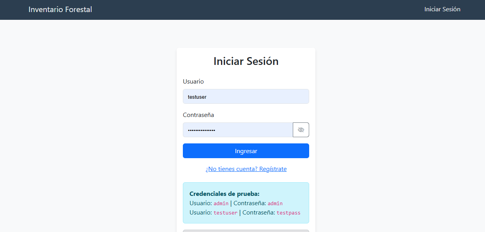
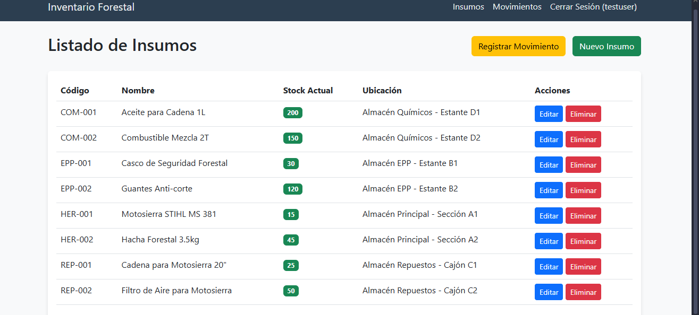
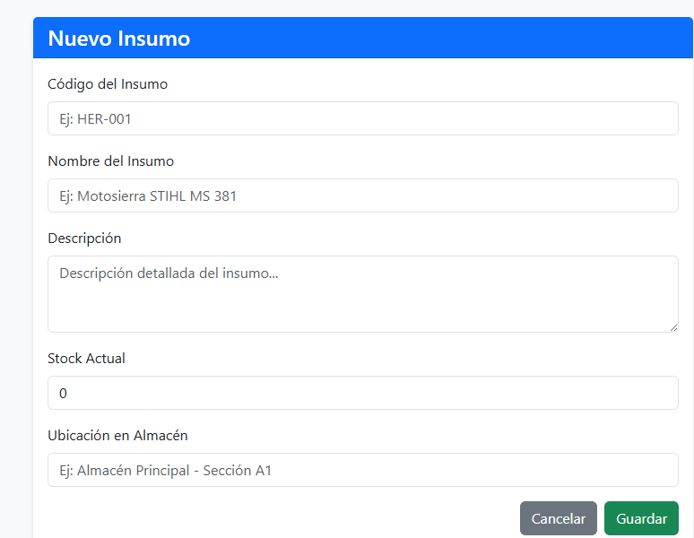
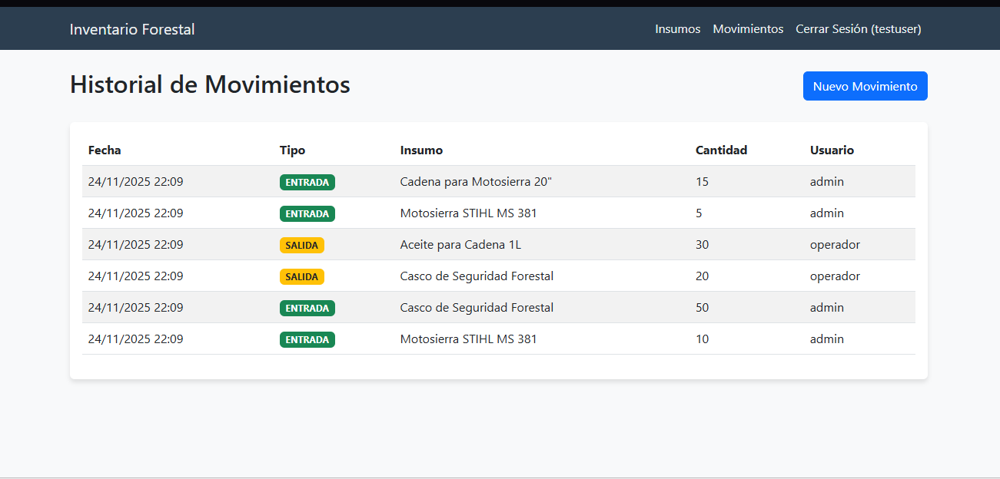
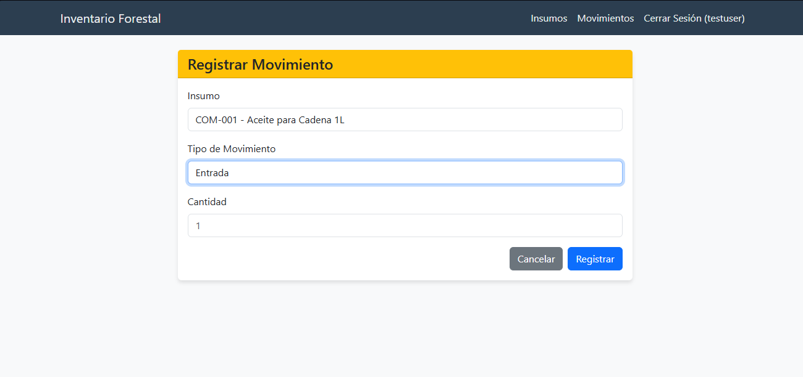
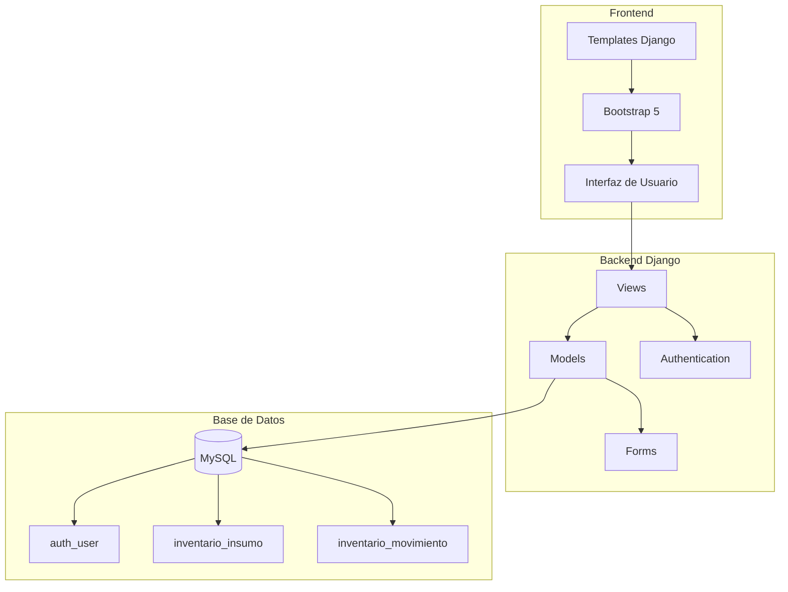
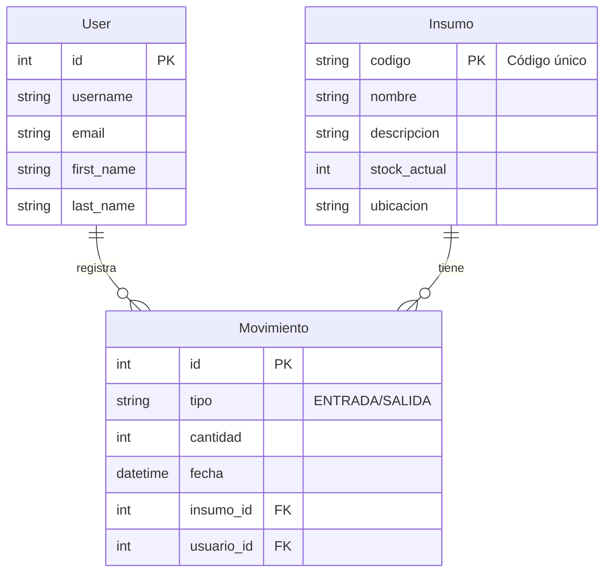

# 🌲 Sistema de Inventario Forestal (Evaluación 3)

Sistema web desarrollado en **Django** para la gestión integral de inventario de insumos y repuestos forestales. Permite controlar stock, registrar movimientos de entrada/salida y gestionar usuarios con autenticación segura.

---

## 📋 Características Principales

- ✅ **Gestión de Insumos**: CRUD completo (Crear, Listar, Editar, Eliminar)
- ✅ **Control de Movimientos**: Registro de entradas y salidas con validación de stock
- ✅ **Validación Automática**: Previene salidas cuando no hay stock suficiente
- ✅ **Sistema de Autenticación**: Login, Logout y Registro de usuarios
- ✅ **Base de Datos MySQL**: Configuración industrial con soporte completo
- ✅ **Interfaz Moderna**: Bootstrap 5 con diseño responsive

---

## 📸 Galería de Capturas

### Login y Autenticación


### Dashboard e Insumos


### Formularios


### Gestión de Movimientos




---

## ⚡ Inicio Rápido

¿Tienes Python y MySQL instalados? Sigue estos pasos para tener el proyecto corriendo en 5 minutos:

```bash
# 1. Clonar y entrar al proyecto
git clone "https://github.com/ColDev-Colivoro/ev3backend.git"
cd ev3backend

# 2. Crear y activar entorno virtual
python -m venv .venv
.venv\Scripts\Activate  # Windows
# source .venv/bin/activate  # Mac/Linux

# 3. Instalar dependencias
pip install -r requirements.txt

# 4. Configurar .env con tus credenciales de MySQL
# (Ver sección de Configuración abajo)

# 5. Inicializar base de datos
python scripts/create_db.py
python scripts/run_sql.py
python manage.py migrate

# 6. Poblar con datos de ejemplo
python scripts/populate_db.py

# 7. Iniciar servidor
python manage.py runserver
```

**¡Listo!** Accede a [http://127.0.0.1:8000/](http://127.0.0.1:8000/)

---

## 🔑 Credenciales de Acceso

El script `populate_db.py` crea los siguientes usuarios por defecto para que puedas probar el sistema inmediatamente:

| Rol | Usuario | Contraseña | Descripción |
|-----|---------|------------|-------------|
| **Superusuario** | `admin` | `admin123` | Acceso total al sistema y panel de administración |
| **Operador** | `operador` | `operador123` | Usuario para registrar movimientos cotidianos |
| **Test** | `testuser` | `testpass` | Usuario de prueba básico |

---

## 📂 Scripts y Utilidades

El proyecto incluye una carpeta `scripts/` con herramientas útiles para la gestión de la base de datos:

### 1. Crear Base de Datos
```bash
python scripts/create_db.py
```
*Crea la base de datos `ev3backend` en MySQL si no existe.*

### 2. Crear Tablas (SQL)
```bash
python scripts/run_sql.py
```
*Ejecuta el archivo `create_tables.sql` para generar la estructura de tablas.*

### 3. Poblar Datos (Seed)
```bash
python scripts/populate_db.py
```
*Crea usuarios, insumos y movimientos de prueba. ¡Ideal para empezar!*

### 4. Crear Superusuario
```bash
python scripts/create_superuser.py
```
*Crea un usuario admin manualmente si lo necesitas.*

---

## 🏗️ Arquitectura del Sistema


    
    style A fill:#4CAF50
    style H fill:#2196F3
    style D fill:#FF9800
```

---

## 📊 Diagrama Entidad-Relación



---

## 🐛 Solución de Problemas Comunes

### ❌ Error: "Unknown database 'ev3backend'"
**Solución:** Ejecuta `python scripts/create_db.py`.

### ❌ Error: "Table doesn't exist"
**Solución:** Ejecuta `python scripts/run_sql.py` y luego `python manage.py migrate`.

### ❌ Error: "Access denied for user 'root'@'localhost'"
**Solución:** Revisa tu archivo `.env`. Asegúrate de que la contraseña (`MYSQL_PASSWORD`) sea la correcta para tu instalación de MySQL.

### ❌ Las imágenes no cargan
**Solución:** Asegúrate de estar ejecutando el servidor desde la carpeta raíz del proyecto y que la carpeta `src/` contenga las imágenes `.png`.

---

## 👨‍💻 Autor

**Jose Camilo Colivoro Uribe**  
Desarrollado para la Evaluación 3 de Backend
