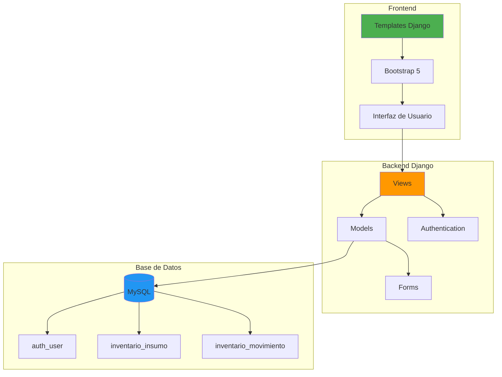
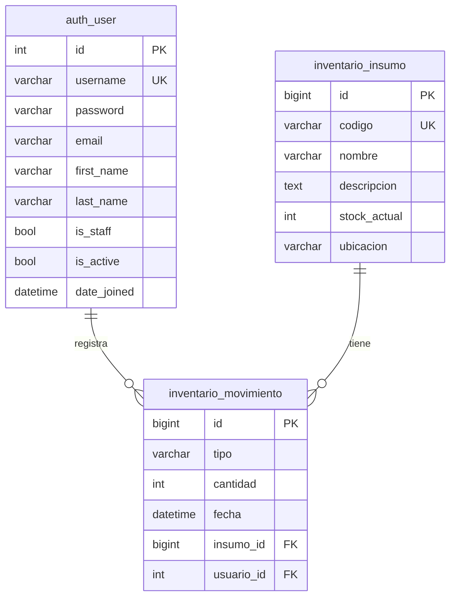
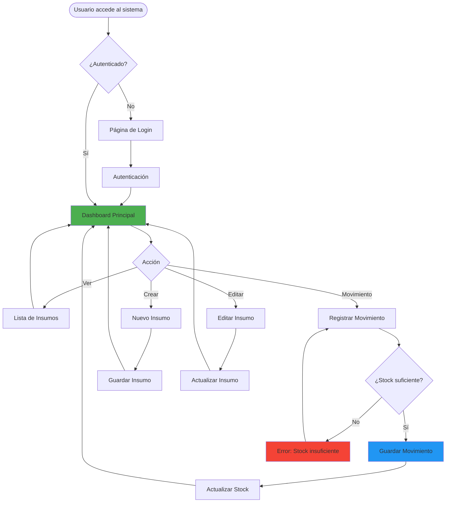

# 🌲 Sistema de Inventario Forestal (Evaluación 3)

Sistema web desarrollado en **Django** para la gestión integral de inventario de insumos y repuestos forestales. Permite controlar stock, registrar movimientos de entrada/salida y gestionar usuarios con autenticación segura.

---

## 📋 Características Principales

- ✅ **Gestión de Insumos**: CRUD completo (Crear, Listar, Editar, Eliminar)
- ✅ **Control de Movimientos**: Registro de entradas y salidas con validación de stock
- ✅ **Validación Automática**: Previene salidas cuando no hay stock suficiente
- ✅ **Sistema de Autenticación**: Login, Logout y Registro de usuarios
- ✅ **Base de Datos MySQL**: Configuración industrial con soporte completo
- ✅ **Interfaz Moderna**: Bootstrap 5 con diseño responsive

---

## 🏗️ Arquitectura del Sistema



---

## 📊 Modelo de Base de Datos



---

## 🚀 Instalación y Configuración

### 1️⃣ Clonar el repositorio y crear entorno virtual

```bash
git clone <url-del-repositorio>
cd ev3backend

# Crear entorno virtual
python -m venv .venv

# Activar entorno virtual
# Windows:
.venv\Scripts\Activate
# Mac/Linux:
source .venv/bin/activate
```

### 2️⃣ Instalar dependencias

```bash
pip install -r requirements.txt
```

**Dependencias principales:**
- `Django` - Framework web
- `mysqlclient` - Conector MySQL
- `python-dotenv` - Gestión de variables de entorno

### 3️⃣ Configuración de Base de Datos (MySQL)

Edita el archivo `.env` en la raíz del proyecto con tus credenciales:

```ini
MYSQL_DB_NAME=ev3backend
MYSQL_USER=root
MYSQL_PASSWORD=tu_password
MYSQL_HOST=localhost
MYSQL_PORT=3306
```

### 4️⃣ Inicializar la Base de Datos

Ejecuta los scripts en el siguiente orden:

```bash
# 1. Crear la base de datos
python scripts/create_db.py

# 2. Ejecutar el script SQL para crear las tablas
python scripts/run_sql.py

# 3. Aplicar migraciones de Django
python manage.py migrate

# 4. Crear un superusuario (opcional)
python scripts/create_superuser.py
```

---

## 🔄 Flujo de Trabajo del Sistema



---

## ▶️ Ejecución

Para iniciar el servidor de desarrollo:

```bash
python manage.py runserver
```

Accede a: **http://127.0.0.1:8000/**

---

## 📖 Guía de Uso

### 1. Inicio de Sesión

Si ejecutaste `create_superuser.py`, usa las credenciales que configuraste.

**Credenciales por defecto del superusuario:**
- **Usuario**: `admin`
- **Contraseña**: `admin123`

### 2. Gestión de Insumos

En la página principal verás la lista de insumos disponibles:

- **➕ Agregar**: Botón "Nuevo Insumo" para crear un nuevo registro
- **✏️ Editar**: Modifica los datos de un insumo existente
- **🗑️ Eliminar**: Elimina un insumo (solo si no tiene movimientos asociados)
- **📊 Ver Stock**: El stock se actualiza automáticamente con cada movimiento

### 3. Registrar Movimientos

Accede a la sección de movimientos para registrar entradas o salidas:

1. Selecciona el insumo
2. Elige el tipo de movimiento (ENTRADA/SALIDA)
3. Indica la cantidad
4. El sistema validará automáticamente si hay stock suficiente para salidas

---

## 📁 Estructura del Proyecto

```
ev3backend/
├── ev3backend/              # Configuración del proyecto Django
│   ├── settings.py         # Configuración principal
│   ├── urls.py             # Rutas principales
│   └── wsgi.py             # Configuración WSGI
├── inventario/             # Aplicación de inventario
│   ├── models.py           # Modelos (Insumo, Movimiento)
│   ├── views.py            # Vistas y lógica de negocio
│   ├── forms.py            # Formularios
│   ├── urls.py             # Rutas de la app
│   └── templates/          # Plantillas HTML
├── scripts/                # Scripts de utilidad
│   ├── create_db.py        # Crea la base de datos
│   ├── create_tables.sql   # Script SQL con todas las tablas
│   ├── run_sql.py          # Ejecuta el script SQL
│   └── create_superuser.py # Crea un superusuario
├── manage.py               # Comando principal de Django
├── requirements.txt        # Dependencias del proyecto
├── .env                    # Variables de entorno (MySQL)
└── README.md               # Este archivo
```

---

## 🛠️ Tecnologías Utilizadas

| Categoría | Tecnología |
|-----------|-----------|
| **Backend** | Python 3.x, Django 5.x |
| **Base de Datos** | MySQL 8.x |
| **Frontend** | HTML5, CSS3, Bootstrap 5 |
| **Autenticación** | Django Auth System |
| **Control de Versiones** | Git |

---

## 📝 Scripts Disponibles

### `scripts/create_db.py`
Crea la base de datos MySQL configurada en el archivo `.env`.

```bash
python scripts/create_db.py
```

### `scripts/run_sql.py`
Ejecuta el archivo `create_tables.sql` para crear todas las tablas necesarias.

```bash
python scripts/run_sql.py
```

### `scripts/create_superuser.py`
Crea un superusuario para acceder al panel de administración.

```bash
python scripts/create_superuser.py
```

---

## 🔒 Seguridad

- ✅ Contraseñas hasheadas con algoritmo PBKDF2
- ✅ Protección CSRF en todos los formularios
- ✅ Validación de datos en el servidor
- ✅ Variables sensibles en archivo `.env` (no versionado)

---

## 🐛 Solución de Problemas

### Error: "Unknown database 'ev3backend'"
**Solución:** Ejecuta `python scripts/create_db.py` para crear la base de datos.

### Error: "Table doesn't exist"
**Solución:** Ejecuta en orden:
1. `python scripts/run_sql.py`
2. `python manage.py migrate`

### Error: "Access denied for user"
**Solución:** Verifica las credenciales en el archivo `.env`.

---

## 👨‍💻 Autor

**Jose Camilo Colivoro Uribe**  
Desarrollado para la Evaluación 3 de Backend  
📧 Contacto: [tu-email@ejemplo.com]

---

## 📄 Licencia

Este proyecto fue desarrollado con fines académicos para la asignatura de Backend.

---

## 🎯 Próximas Mejoras

- [ ] API REST con Django REST Framework
- [ ] Reportes en PDF
- [ ] Gráficos de stock histórico
- [ ] Notificaciones de stock bajo
- [ ] Exportación a Excel
