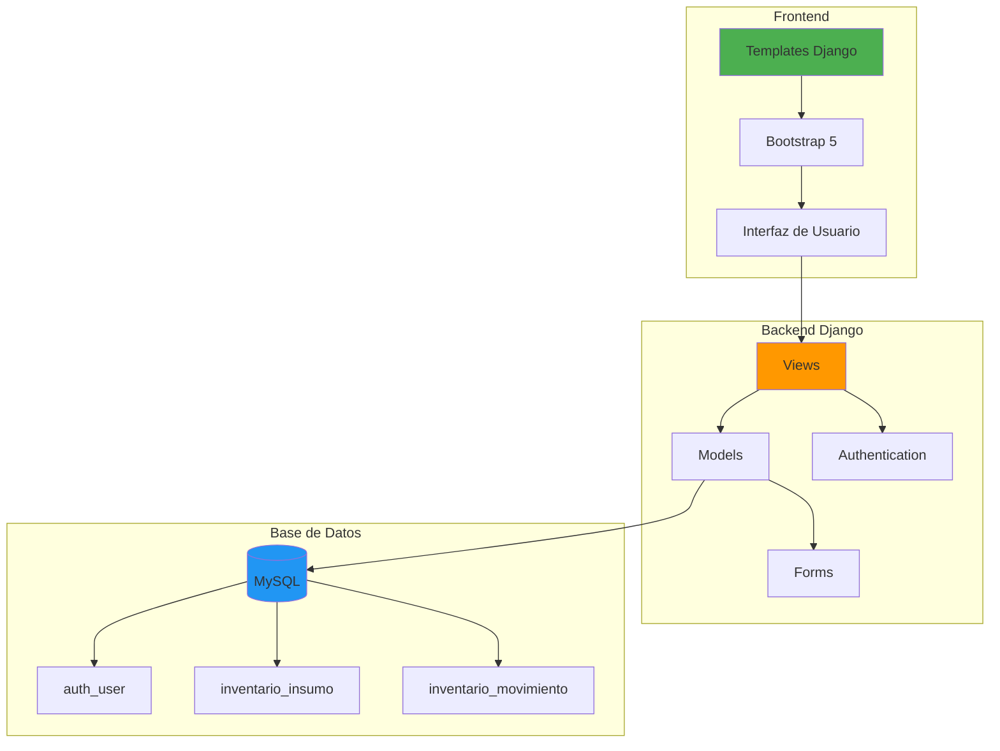
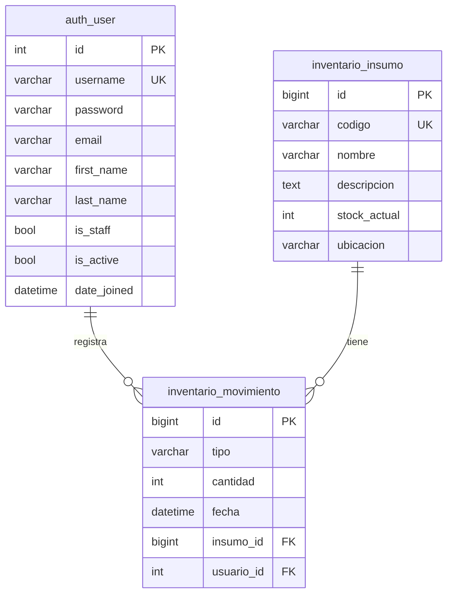
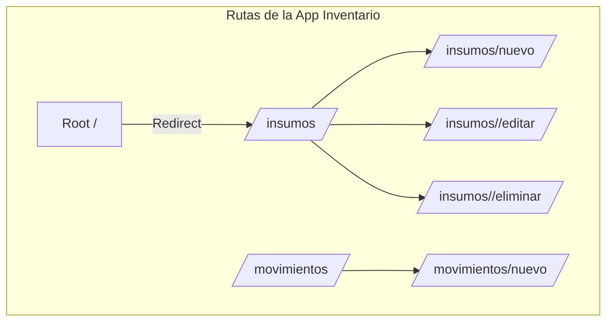

# 🌲 Sistema de Inventario Forestal (Evaluación 3)

Sistema web desarrollado en **Django** para la gestión integral de inventario de insumos y repuestos forestales. Permite controlar stock, registrar movimientos de entrada/salida y gestionar usuarios con autenticación segura.

---

## 📋 Características Principales

- ✅ **Gestión de Insumos**: CRUD completo (Crear, Listar, Editar, Eliminar)
- ✅ **Control de Movimientos**: Registro de entradas y salidas con validación de stock
- ✅ **Validación Automática**: Previene salidas cuando no hay stock suficiente
- ✅ **Sistema de Autenticación**: Login, Logout y Registro de usuarios
- ✅ **Base de Datos MySQL**: Configuración industrial con soporte completo
- ✅ **Interfaz Moderna**: Bootstrap 5 con diseño responsive

---

## ⚡ Inicio Rápido

¿Tienes Python y MySQL instalados? Sigue estos pasos para tener el proyecto corriendo en 5 minutos:

```bash
# 1. Clonar y entrar al proyecto
git clone "https://github.com/ColDev-Colivoro/ev3backend.git"
cd ev3backend

# 2. Crear y activar entorno virtual
python -m venv .venv
.venv\Scripts\Activate  # Windows
# source .venv/bin/activate  # Mac/Linux

# 3. Instalar dependencias
pip install -r requirements.txt

# 4. Configurar .env con tus credenciales de MySQL
# Edita el archivo .env y pon tu contraseña de MySQL

# 5. Inicializar base de datos
python scripts/create_db.py
python scripts/run_sql.py
python manage.py migrate

# 6. Poblar con datos de ejemplo
python scripts/populate_db.py

# 7. Iniciar servidor
python manage.py runserver
```

**¡Listo!** Accede a [http://127.0.0.1:8000/](http://127.0.0.1:8000/) y usa:
- **Usuario:** `admin` | **Contraseña:** `admin123`

> 💡 **Nota:** Si encuentras errores, revisa la sección [Solución de Problemas](#-solución-de-problemas-comunes) más abajo.

---

## 🏗️ Arquitectura del Sistema



---

## 📊 Modelo de Base de Datos



---

## 📋 Prerequisitos

Antes de comenzar, asegúrate de tener instalado lo siguiente en tu sistema:

### 1. Python 3.8 o superior
Verifica si tienes Python instalado:
```bash
python --version
```

Si no lo tienes, descárgalo desde: [https://www.python.org/downloads/](https://www.python.org/downloads/)

> **Importante para Windows:** Durante la instalación, marca la opción "Add Python to PATH"

### 2. MySQL Server 8.0 o superior
Necesitas tener MySQL instalado y corriendo en tu sistema.

**Descargar MySQL:**
- Windows/Mac: [https://dev.mysql.com/downloads/mysql/](https://dev.mysql.com/downloads/mysql/)
- Linux: `sudo apt-get install mysql-server` (Ubuntu/Debian)

**Verificar que MySQL está corriendo:**
```bash
mysql --version
```

**Credenciales necesarias:**
- Usuario (por defecto: `root`)
- Contraseña (la que configuraste durante la instalación)
- Puerto (por defecto: `3306`)

### 3. Git (opcional, para clonar el repositorio)
```bash
git --version
```

Si no lo tienes: [https://git-scm.com/downloads](https://git-scm.com/downloads)

---

## 🚀 Instalación y Configuración

### 1️⃣ Clonar el repositorio y crear entorno virtual

```bash
git clone "https://github.com/ColDev-Colivoro/ev3backend.git"
cd ev3backend

# Crear entorno virtual
python -m venv .venv

# Activar entorno virtual
# Windows:
.venv\Scripts\Activate
# Mac/Linux:
source .venv/bin/activate
```

### 2️⃣ Instalar dependencias

```bash
pip install -r requirements.txt
```

**Dependencias principales:**
- `Django` - Framework web
- `mysqlclient` - Conector MySQL
- `python-dotenv` - Gestión de variables de entorno

### 3️⃣ Configuración de Base de Datos (MySQL)

El proyecto incluye un archivo `.env` en la raíz. **Debes editarlo** con tus credenciales de MySQL.

**Abre el archivo `.env` y modifica los valores:**

```ini
MYSQL_DB_NAME=ev3backend
MYSQL_USER=root
MYSQL_PASSWORD=tu_password_aqui
MYSQL_HOST=localhost
MYSQL_PORT=3306
```

> **⚠️ Importante:** 
> - Reemplaza `tu_password_aqui` con la contraseña de tu usuario MySQL
> - Si tu usuario de MySQL no es `root`, cámbialo también
> - El archivo `.env` NO debe subirse a Git (ya está en `.gitignore`)

**Ejemplo de configuración típica:**
```ini
MYSQL_DB_NAME=ev3backend
MYSQL_USER=root
MYSQL_PASSWORD=miPassword123
MYSQL_HOST=localhost
MYSQL_PORT=3306
```

### 4️⃣ Inicializar la Base de Datos

Ejecuta los scripts en el siguiente orden:

```bash
# 1. Crear la base de datos
python scripts/create_db.py

# 2. Ejecutar el script SQL para crear las tablas
python scripts/run_sql.py

# 3. Aplicar migraciones de Django
python manage.py migrate

# 4. Crear un superusuario (opcional)
python scripts/create_superuser.py

# 5. Poblar la base de datos con datos de ejemplo (recomendado)
python scripts/populate_db.py
```

> **Nota:** El script `populate_db.py` crea usuarios de prueba, insumos forestales y movimientos de ejemplo para que puedas probar la aplicación inmediatamente.

---

## 🔄 Flujo de Trabajo del Sistema


---

## ▶️ Ejecución

Para iniciar el servidor de desarrollo:

```bash
python manage.py runserver
```

Accede a: **http://127.0.0.1:8000/**
- **Contraseña**: `admin123`

### 2. Gestión de Insumos

En la página principal verás la lista de insumos disponibles:

- **➕ Agregar**: Botón "Nuevo Insumo" para crear un nuevo registro
- **✏️ Editar**: Modifica los datos de un insumo existente
- **🗑️ Eliminar**: Elimina un insumo (solo si no tiene movimientos asociados)
- **📊 Ver Stock**: El stock se actualiza automáticamente con cada movimiento

### 3. Registrar Movimientos

Accede a la sección de movimientos para registrar entradas o salidas:

1. Selecciona el insumo
2. Elige el tipo de movimiento (ENTRADA/SALIDA)
3. Indica la cantidad
4. El sistema validará automáticamente si hay stock suficiente para salidas

---

## 📁 Estructura del Proyecto

```text
ev3backend/
├── ev3backend/              # Configuración del proyecto Django
│   ├── settings.py         # Configuración principal
│   ├── urls.py             # Rutas principales
│   └── wsgi.py             # Configuración WSGI
├── inventario/             # Aplicación de inventario
│   ├── models.py           # Modelos (Insumo, Movimiento)
│   ├── views.py            # Vistas y lógica de negocio
│   ├── forms.py            # Formularios
│   ├── urls.py             # Rutas de la app
│   └── templates/          # Plantillas HTML
├── scripts/                # Scripts de utilidad
│   ├── create_db.py        # Crea la base de datos
│   ├── create_tables.sql   # Script SQL con todas las tablas
│   ├── run_sql.py          # Ejecuta el script SQL
│   ├── create_superuser.py # Crea un superusuario
│   └── populate_db.py      # Pobla la BD con datos de ejemplo
├── manage.py               # Comando principal de Django
├── requirements.txt        # Dependencias del proyecto
├── .env                    # Variables de entorno (MySQL)
└── README.md               # Este archivo
```

---

## 🗺️ Diagrama de Rutas



---

## 📸 Vista Principal del Dashboard


---

## 📜 Uso de Scripts y Errores Comunes

- **Crear la base de datos**: `python scripts/create_db.py`
- **Crear tablas**: `python scripts/run_sql.py`
- **Aplicar migraciones**: `python manage.py migrate`
- **Crear superusuario**: `python scripts/create_superuser.py`
- **Poblar datos de ejemplo**: `python scripts/populate_db.py`

> **Errores comunes**
> - **"Unknown database 'ev3backend'"**: Ejecuta `python scripts/create_db.py`.
> - **"Table doesn't exist"**: Ejecuta `python scripts/run_sql.py` y luego `python manage.py migrate`.
> - **"Access denied for user 'root'@'localhost'"**: Verifica credenciales en `.env`.
> - **"No module named 'MySQLdb'"**: Instala `mysqlclient` con las herramientas de compilación apropiadas.
> - **"Can't connect to MySQL server"**: Asegúrate de que MySQL esté corriendo.


```
ev3backend/
├── ev3backend/              # Configuración del proyecto Django
│   ├── settings.py         # Configuración principal
│   ├── urls.py             # Rutas principales
│   └── wsgi.py             # Configuración WSGI
├── inventario/             # Aplicación de inventario
│   ├── models.py           # Modelos (Insumo, Movimiento)
│   ├── views.py            # Vistas y lógica de negocio
│   ├── forms.py            # Formularios
│   ├── urls.py             # Rutas de la app
│   └── templates/          # Plantillas HTML
├── scripts/                # Scripts de utilidad
│   ├── create_db.py        # Crea la base de datos
│   ├── create_tables.sql   # Script SQL con todas las tablas
│   ├── run_sql.py          # Ejecuta el script SQL
│   ├── create_superuser.py # Crea un superusuario
│   └── populate_db.py      # Pobla la BD con datos de ejemplo
├── manage.py               # Comando principal de Django
├── requirements.txt        # Dependencias del proyecto
├── .env                    # Variables de entorno (MySQL)
└── README.md               # Este archivo
```

---

## 🛠️ Tecnologías Utilizadas

| Categoría | Tecnología |
|-----------|-----------|
| **Backend** | Python 3.x, Django 5.x |
| **Base de Datos** | MySQL 8.x |
| **Frontend** | HTML5, CSS3, Bootstrap 5 |
| **Autenticación** | Django Auth System |
| **Control de Versiones** | Git |

---

## 📝 Scripts Disponibles

### `scripts/create_db.py`
Crea la base de datos MySQL configurada en el archivo `.env`.

```bash
python scripts/create_db.py
```

### `scripts/run_sql.py`
Ejecuta el archivo `create_tables.sql` para crear todas las tablas necesarias.

```bash
python scripts/run_sql.py
```

### `scripts/create_superuser.py`
Crea un superusuario para acceder al panel de administración.

```bash
python scripts/create_superuser.py
```

### `scripts/populate_db.py`
Pobla la base de datos con datos de ejemplo (usuarios, insumos forestales y movimientos).

```bash
python scripts/populate_db.py
```

**Datos creados:**
- 3 usuarios de prueba (admin, testuser, operador)
- 8 insumos forestales con stock inicial
- 6 movimientos de ejemplo (entradas y salidas)

---

## 🔒 Seguridad

- ✅ Contraseñas hasheadas con algoritmo PBKDF2
- ✅ Protección CSRF en todos los formularios
- ✅ Validación de datos en el servidor
- ✅ Variables sensibles en archivo `.env` (no versionado)

---

## 🐛 Solución de Problemas Comunes

### ❌ Error: "Unknown database 'ev3backend'"
**Causa:** La base de datos no ha sido creada en MySQL.

**Solución:**
```bash
python scripts/create_db.py
```

### ❌ Error: "Table doesn't exist"
**Causa:** Las tablas no han sido creadas en la base de datos.

**Solución:** Ejecuta los scripts en orden:
```bash
python scripts/run_sql.py
python manage.py migrate
```

### ❌ Error: "Access denied for user 'root'@'localhost'"
**Causa:** Credenciales incorrectas en el archivo `.env`.

**Solución:**
1. Verifica tu contraseña de MySQL
2. Abre el archivo `.env` y actualiza `MYSQL_PASSWORD` con la contraseña correcta
3. Si usas otro usuario diferente a `root`, actualiza también `MYSQL_USER`

### ❌ Error: "No module named 'MySQLdb'"
**Causa:** La dependencia `mysqlclient` no está instalada correctamente.

**Solución Windows:**
```bash
# Instalar Microsoft C++ Build Tools primero
# Descargar de: https://visualstudio.microsoft.com/visual-cpp-build-tools/
pip install mysqlclient
```

**Solución Linux:**
```bash
sudo apt-get install python3-dev default-libmysqlclient-dev build-essential
pip install mysqlclient
```

**Solución Mac:**
```bash
brew install mysql
pip install mysqlclient
```

### ❌ Error: "Can't connect to MySQL server"
**Causa:** El servidor MySQL no está corriendo.

**Solución:**
- **Windows:** Abre "Servicios" y verifica que "MySQL" esté iniciado
- **Linux:** `sudo service mysql start`
- **Mac:** `brew services start mysql`

### ❌ Error: "python: command not found"
**Causa:** Python no está en el PATH del sistema.

**Solución:**
- Reinstala Python y marca "Add Python to PATH"
- O usa `python3` en lugar de `python` (en Mac/Linux)

### ❌ El servidor corre pero no puedo acceder
**Causa:** Firewall o puerto ocupado.

**Solución:**
1. Verifica que no haya otro proceso usando el puerto 8000
2. Intenta con otro puerto: `python manage.py runserver 8080`
3. Accede a: `http://127.0.0.1:8080/`

### ❌ Error: "No such file or directory: '.env'"
**Causa:** El archivo `.env` no existe o está en la ubicación incorrecta.

**Solución:**
1. Verifica que el archivo `.env` esté en la raíz del proyecto (mismo nivel que `manage.py`)
2. Si no existe, créalo con el siguiente contenido:
```ini
MYSQL_DB_NAME=ev3backend
MYSQL_USER=root
MYSQL_PASSWORD=tu_password
MYSQL_HOST=localhost
MYSQL_PORT=3306
```

### 💡 ¿Aún tienes problemas?
Si ninguna de estas soluciones funciona:
1. Verifica que completaste TODOS los pasos de instalación en orden
2. Asegúrate de tener activado el entorno virtual (`.venv`)
3. Revisa los logs de error completos para más detalles

---

## 👨‍💻 Autor

**Jose Camilo Colivoro Uribe**  
Desarrollado para la Evaluación 3 de Backend  
📧 Contacto: [tu-email@ejemplo.com]

---

## 📄 Licencia

Este proyecto fue desarrollado con fines académicos para la asignatura de Backend.

---

## 🎯 Próximas Mejoras

- [ ] API REST con Django REST Framework
- [ ] Reportes en PDF
- [ ] Gráficos de stock histórico
- [ ] Notificaciones de stock bajo
- [ ] Exportación a Excel
